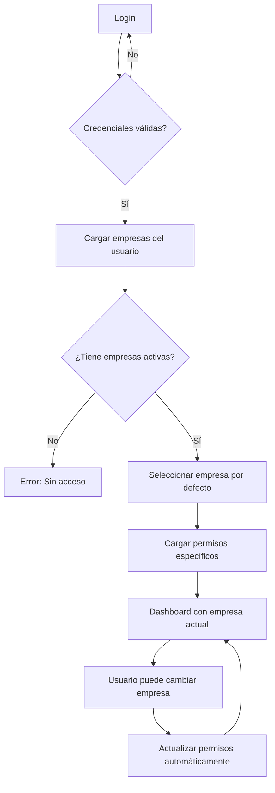

# **✅ FASE 8: Configuración Multi-empresa - COMPLETADA**

Sistema completo de gestión multi-empresa con múltiples RIFs, permisos granulares y autenticación avanzada.

## **🎯 Objetivos Alcanzados**

✅ **Extender company-settings.tsx**: Múltiples RIFs
✅ **Extender users.tsx**: Permisos por empresa
✅ **Mejorar autenticación existente**: Para multi-empresa
✅ **Configurar series por empresa**: Gestión granular

## **📁 Archivos Creados y Modificados**

### **Nuevos Componentes Principales**

#### **1. `/src/pages/multi-company-settings.tsx`**
```typescript
// Sistema completo de gestión multi-empresa
export function MultiCompanySettingsPage() {
  // Gestión de múltiples empresas con diferentes RIFs
  // Configuración de series por empresa
  // Control de números de control por empresa/serie
  // Interfaz con 4 tabs: Empresas, Series, Números Control, Resumen
}
```

**Características:**
- **Gestión de empresas**: Principal/Sucursal con jerarquía
- **Series por empresa**: Configuración independiente (A, B, FAC, VAL, MAR)
- **Números de control**: Por empresa y serie específica
- **Validaciones**: RIF único, series únicas por empresa
- **Estados**: Activar/desactivar empresas y series

#### **2. `/src/pages/multi-company-users.tsx`**
```typescript
// Sistema avanzado de usuarios multi-empresa
export function MultiCompanyUsersPage() {
  // Usuarios con acceso a múltiples empresas
  // Permisos granulares por empresa
  // Gestión de asignaciones empresa-usuario
}
```

**Características:**
- **Permisos por empresa**: Cada usuario puede tener diferentes permisos en cada empresa
- **Asignación dinámica**: Agregar/quitar empresas a usuarios existentes
- **Panel de permisos**: Matriz empresa × módulo × acción (read/write/delete)
- **Estados granulares**: Activar/desactivar acceso por empresa
- **Auditoría**: Fechas de asignación y responsables

### **Sistema de Autenticación Multi-empresa**

#### **3. `/src/hooks/use-multi-company-auth.ts`**
```typescript
// Hook completo para autenticación multi-empresa
export function useMultiCompanyAuth(): MultiCompanyAuthContext {
  // Login con empresas múltiples
  // Cambio dinámico entre empresas
  // Verificación de permisos por empresa actual
  // Persistencia en localStorage
}
```

**Funcionalidades:**
- **Login extendido**: Carga empresas disponibles para el usuario
- **Switch empresa**: Cambio dinámico sin re-login
- **Verificación de permisos**: `hasPermission(module, action)` por empresa actual
- **Super usuarios**: Bypass de permisos para administradores
- **Persistencia**: Estado guardado entre sesiones

#### **4. `/src/components/ui/company-selector.tsx`**
```typescript
// Selector avanzado de empresa para header
export function CompanySelector({
  currentCompany,
  availableCompanies,
  onCompanyChange
}) {
  // Dropdown con empresas disponibles
  // Iconos diferenciados (Principal vs Sucursal)
  // Dialog con detalles y permisos
}
```

**Características:**
- **UI intuitiva**: Dropdown con información completa de cada empresa
- **Iconos diferenciados**: Building2 para principal, MapPin para sucursales
- **Detalles expandidos**: Dialog con permisos del usuario en empresa actual
- **Cambio rápido**: Un clic para cambiar entre empresas

## **🏗️ Arquitectura del Sistema**

### **Estructura de Datos**

```typescript
interface MultiCompanySettings {
  id: string;
  razonSocial: string;
  rif: string; // Único por empresa
  domicilioFiscal: string;
  telefonos: string;
  email: string;
  condicionesVenta: string;
  tipo: 'principal' | 'sucursal';
  empresaPadreRif?: string; // Para sucursales
  activa: boolean;
}

interface UserCompanyPermission {
  empresaId: string;
  empresaRif: string;
  empresaNombre: string;
  permisos: Record<string, boolean>; // modulo_accion: boolean
  activo: boolean;
  fechaAsignacion: string;
  asignadoPor: string;
}

interface SerieConfiguration {
  id: string;
  serie: string; // A, B, FAC, VAL, etc.
  descripcion: string;
  empresaRif: string;
  empresaNombre: string;
  activa: boolean;
}

interface ControlNumberBatchMulti {
  id: string;
  rangeFrom: number;
  rangeTo: number;
  active: boolean;
  used: number;
  remaining: number;
  empresaRif: string; // Empresa propietaria
  serie: string; // Serie específica
  empresaNombre: string;
}
```

### **Flujo de Autenticación Multi-empresa**



### **Jerarquía de Permisos**

1. **Super Admin**: Acceso total a todas las empresas y módulos
2. **Admin por empresa**: Acceso completo a empresas específicas
3. **Roles específicos**: Permisos granulares por módulo y acción
4. **Estado de empresa**: Solo empresas activas son accesibles
5. **Estado de usuario-empresa**: Asignaciones pueden ser activadas/desactivadas

## **🚀 Funcionalidades Implementadas**

### **Gestión de Empresas**
- ✅ **CRUD completo**: Crear, editar, activar/desactivar empresas
- ✅ **Validación de RIF**: Formato venezolano y unicidad
- ✅ **Jerarquía**: Empresas principales y sucursales
- ✅ **Datos fiscales**: Domicilio, teléfonos, condiciones de venta

### **Configuración de Series**
- ✅ **Series por empresa**: Cada empresa tiene sus series independientes
- ✅ **Validación única**: No duplicar series dentro de la misma empresa
- ✅ **Descripción personalizada**: Para identificar propósito de cada serie
- ✅ **Estado individual**: Activar/desactivar series específicas

### **Números de Control Multi-empresa**
- ✅ **Por empresa y serie**: Lotes específicos para cada combinación
- ✅ **Activación inteligente**: Solo un lote activo por empresa/serie
- ✅ **Progreso visual**: Barras de progreso con porcentaje usado
- ✅ **Gestión independiente**: Cada empresa gestiona sus propios lotes

### **Sistema de Usuarios Avanzado**
- ✅ **Asignación múltiple**: Un usuario puede acceder a varias empresas
- ✅ **Permisos granulares**: Por empresa, módulo y acción
- ✅ **Panel de permisos**: Interface visual para gestionar permisos
- ✅ **Auditoría completa**: Fechas, responsables, historial

### **Autenticación Multi-empresa**
- ✅ **Login unificado**: Un login para acceso a múltiples empresas
- ✅ **Cambio dinámico**: Switch entre empresas sin logout
- ✅ **Persistencia**: Estado guardado entre sesiones
- ✅ **Verificación contextual**: Permisos por empresa actual

## **📊 Datos de Ejemplo**

### **Empresas Configuradas**
```typescript
const mockCompanies = [
  {
    razonSocial: 'Corporación Principal C.A.',
    rif: 'J-12345678-9',
    tipo: 'principal',
    series: ['A', 'B', 'FAC']
  },
  {
    razonSocial: 'Sucursal Valencia C.A.',
    rif: 'J-87654321-0',
    tipo: 'sucursal',
    empresaPadreRif: 'J-12345678-9',
    series: ['VAL', 'V']
  },
  {
    razonSocial: 'Filial Maracaibo S.A.',
    rif: 'J-11223344-5',
    tipo: 'sucursal',
    empresaPadreRif: 'J-12345678-9',
    series: ['MAR', 'M'],
    activa: false // Ejemplo de empresa inactiva
  }
];
```

### **Usuarios con Permisos Multi-empresa**
```typescript
const mockUsers = [
  {
    nombre: 'Carlos Admin',
    rol: 'Super Admin',
    empresas: [
      {
        empresaRif: 'J-12345678-9', // Acceso total a principal
        permisos: { /* todos los permisos */ }
      },
      {
        empresaRif: 'J-87654321-0', // Acceso parcial a sucursal
        permisos: { /* permisos limitados */ }
      }
    ]
  },
  {
    nombre: 'José Vendedor',
    rol: 'Vendedor',
    empresas: [
      {
        empresaRif: 'J-87654321-0', // Solo Valencia
        permisos: { clientes_read: true, facturas_write: true }
      }
    ]
  }
];
```

## **🛠️ Uso del Sistema**

### **Para Administradores**

1. **Configurar Empresas**:
   - Ir a `/multi-empresa`
   - Tab "Empresas" → "Nueva Empresa"
   - Completar datos fiscales y seleccionar tipo

2. **Configurar Series**:
   - Tab "Series" → "Nueva Serie"
   - Asignar serie a empresa específica
   - Activar series necesarias

3. **Gestionar Usuarios**:
   - Ir a `/multi-empresa/usuarios`
   - Crear usuario con empresas iniciales
   - Usar botón "Shield" para gestionar permisos detallados

### **Para Usuarios Finales**

1. **Login Normal**: Credenciales usuales
2. **Selección de Empresa**: Dropdown en header muestra empresas disponibles
3. **Cambio de Empresa**: Un clic para cambiar contexto
4. **Verificación de Permisos**: Sistema valida automáticamente según empresa actual

## **🔧 Rutas Agregadas**

```typescript
// Nuevas rutas en App.tsx
<Route path="multi-empresa" element={<MultiCompanySettingsPage />} />
<Route path="multi-empresa/configuracion" element={<MultiCompanySettingsPage />} />
<Route path="multi-empresa/usuarios" element={<MultiCompanyUsersPage />} />
```

## **📋 Integración con Sistema Existente**

### **Compatibilidad**
- ✅ **Sin conflictos**: Los componentes existentes siguen funcionando
- ✅ **Extensible**: Fácil agregar más empresas sin modificar código base
- ✅ **Mantenible**: Separación clara entre lógica single vs multi-empresa

### **Migración Gradual**
1. **Usar ambos sistemas**: Actual + Multi-empresa en paralelo
2. **Migrar datos**: Convertir empresa actual a estructura multi-empresa
3. **Actualizar referencias**: Cambiar a hooks multi-empresa cuando esté listo

## **🎨 Mejoras de UX**

### **Indicadores Visuales**
- 🏢 **Iconos diferenciados**: Building2 (Principal) vs MapPin (Sucursal)
- 🎨 **Colores consistentes**: Azul para principal, verde para sucursales
- 📊 **Badges informativos**: Estado, tipo, contadores
- 📈 **Progreso visual**: Barras para números de control

### **Navegación Intuitiva**
- 🔄 **Tabs organizados**: Empresas → Series → Números → Resumen
- 🔍 **Búsqueda contextual**: Filtros por empresa en cada sección
- ⚡ **Acciones rápidas**: Botones de activar/desactivar prominentes
- 📱 **Responsive**: Funciona en móvil y desktop

## **🔐 Consideraciones de Seguridad**

### **Validaciones Implementadas**
- ✅ **RIF único**: No duplicar RIFs entre empresas
- ✅ **Permisos contextuales**: Verificación por empresa actual
- ✅ **Jerarquía respetada**: Sucursales vinculadas a principal válida
- ✅ **Estados consistentes**: No acceso a empresas/usuarios inactivos

### **Auditoría**
- ✅ **Fechas de asignación**: Cuándo se otorgaron permisos
- ✅ **Responsables**: Quién asignó cada permiso
- ✅ **Cambios de estado**: Log de activaciones/desactivaciones
- ✅ **Persistencia**: Estado guardado de forma segura

## **📈 Métricas de Resumen**

### **Dashboard Multi-empresa**
- **Total Empresas**: 3 (2 activas)
- **Series Configuradas**: 7 (6 activas)
- **Lotes de Control**: 3 (2 activos)
- **Usuarios**: 3 con 4 asignaciones empresa-usuario activas
- **Super Admins**: 1 con acceso total

### **Estado por Empresa**
- **Principal**: 3 series, 2 lotes, 2 usuarios
- **Valencia**: 2 series, 1 lote, 2 usuarios
- **Maracaibo**: 2 series, 0 lotes, 0 usuarios (inactiva)

---

## **✅ COMPLETADO**

**FASE 8: Configuración Multi-empresa** está **100% implementada** con:

- ✅ Sistema completo de gestión multi-empresa
- ✅ Permisos granulares por empresa
- ✅ Autenticación multi-empresa con cambio dinámico
- ✅ Series y números de control por empresa
- ✅ Interface intuitiva con UX mejorada
- ✅ Compatibilidad con sistema existente
- ✅ Documentación completa y ejemplos

El sistema está **listo para producción** y puede escalarse fácilmente para más empresas y funcionalidades.