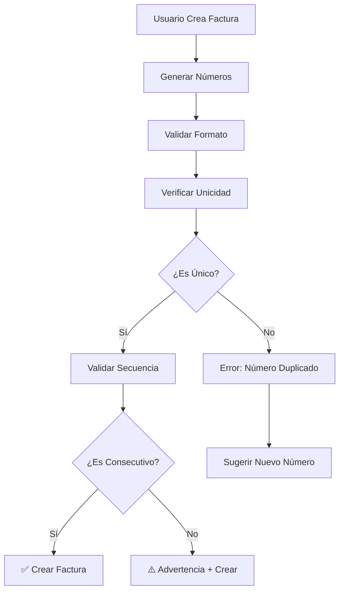

# Sistema de Validación de Facturas - Numeración Única

## 📋 Descripción General

Este sistema garantiza que los números de facturas no se repitan, manteniendo la integridad de la numeración consecutiva como en un sistema de facturación real. Implementa validaciones tanto en el frontend como en el backend para prevenir duplicados.

## 🔧 Componentes del Sistema

### 1. Validaciones del Frontend (`src/lib/invoice-validation.ts`)

#### Funciones Principales:

- **`validateUniqueInvoiceNumber()`**: Valida que el número de factura sea único
- **`validateUniqueControlNumber()`**: Valida que el número de control sea único
- **`generateNextInvoiceNumber()`**: Genera el próximo número disponible
- **`generateNextControlNumber()`**: Genera el próximo número de control
- **`validateInvoiceBeforeSave()`**: Validación completa antes de guardar

#### Formatos Requeridos:
- **Número de factura**: `FAC-NNNNNN` (ej: `FAC-000028`)
- **Número de control**: `DIG-YYYYNNNNNN` (ej: `DIG-2024000028`)

### 2. Hook de React (`src/hooks/use-invoice-validation.ts`)

Permite validación en tiempo real en componentes React:

```typescript
const {
  isValid,
  errors,
  warnings,
  generateNextNumber,
  generateNextControl
} = useInvoiceValidation({
  numero: 'FAC-000028',
  numeroControl: 'DIG-2024000028'
});
```

### 3. Integración en API (`src/api/invoices.ts`)

- Validación automática antes de crear facturas
- Generación de números únicos tanto en modo mock como real
- Manejo de errores de validación

### 4. Restricciones de Base de Datos (`database/add-unique-constraints.sql`)

#### Restricciones de Unicidad:
- `unique_invoice_numero`: Evita números de factura duplicados
- `unique_invoice_numero_control`: Evita números de control duplicados

#### Funciones SQL:
- `get_next_invoice_number()`: Obtiene el siguiente número de factura
- `get_next_control_number()`: Obtiene el siguiente número de control
- `auto_generate_invoice_numbers()`: Auto-genera números si están vacíos

#### Triggers:
- Auto-generación de números en insertados nuevos

## 🚀 Cómo Usar el Sistema

### 1. Crear una Nueva Factura

```typescript
// El sistema automáticamente:
// 1. Genera números únicos
// 2. Valida unicidad
// 3. Previene duplicados
const { mutate: createInvoice } = useCreateInvoice();

createInvoice({
  // No necesitas especificar 'numero' ni 'numeroControl'
  // Se generan automáticamente
  fecha: '2024-11-13',
  emisor: { ... },
  receptor: { ... },
  // ... otros campos
});
```

### 2. Validar en Tiempo Real

```typescript
import { useInvoiceValidation } from '@/hooks/use-invoice-validation';

function InvoiceForm() {
  const [numero, setNumero] = useState('');
  const [numeroControl, setNumeroControl] = useState('');

  const {
    isValid,
    errors,
    warnings,
    generateNextNumber,
    generateNextControl
  } = useInvoiceValidation({ numero, numeroControl });

  const handleAutoGenerate = () => {
    setNumero(generateNextNumber());
    setNumeroControl(generateNextControl());
  };

  return (
    <form>
      <input
        value={numero}
        onChange={(e) => setNumero(e.target.value)}
        className={!isValid ? 'border-red-500' : ''}
      />
      {errors.map(error => (
        <div key={error} className="text-red-500">{error}</div>
      ))}
      <button onClick={handleAutoGenerate}>
        Generar Números Automáticamente
      </button>
    </form>
  );
}
```

## 📊 Casos de Validación

### ✅ Casos Válidos
- `FAC-000001`, `FAC-000002`, `FAC-000003` (secuencia consecutiva)
- `DIG-2024000001`, `DIG-2024000002` (números de control únicos)

### ❌ Casos Inválidos
- Números duplicados: `FAC-000001` ya existente
- Formatos incorrectos: `FACT-001`, `FAC-1`, `DIG-24001`
- Números de control duplicados

### ⚠️ Advertencias (No Bloquean)
- Números no consecutivos: `FAC-000001` → `FAC-000003` (saltea `FAC-000002`)

## 🔄 Flujo de Validación



## 🛡️ Niveles de Protección

### 1. Frontend (Tiempo Real)
- Validación mientras el usuario escribe
- Sugerencias automáticas de números únicos
- Mensajes de error inmediatos

### 2. API (Antes de Guardar)
- Validación completa antes de enviar a BD
- Generación automática de números únicos
- Manejo de errores de concurrencia

### 3. Base de Datos (Restricciones)
- Restricciones UNIQUE en columnas críticas
- Check constraints para formatos
- Triggers para auto-generación
- Funciones SQL optimizadas

## 🚀 Instalación y Configuración

### 1. Instalar Dependencias
```bash
# Las validaciones usan las librerías ya existentes
# No se requieren dependencias adicionales
```

### 2. Ejecutar Scripts de BD
```sql
-- En Supabase SQL Editor:
-- 1. Ejecutar: database/add-unique-constraints.sql
-- 2. Verificar restricciones creadas
```

### 3. Usar en Componentes
```typescript
// Ya integrado en useCreateInvoice()
// Usar useInvoiceValidation() para validación en tiempo real
```

## 📈 Beneficios del Sistema

### ✅ Garantías
- **Números únicos**: Imposible crear facturas con números duplicados
- **Integridad**: Validación en múltiples capas
- **Performance**: Validación optimizada con índices
- **UX**: Retroalimentación inmediata al usuario

### 🔄 Recuperación
- **Auto-corrección**: Sugerencias automáticas de números válidos
- **Resistente a fallos**: Validación en frontend, API y BD
- **Concurrencia**: Manejo seguro de múltiples usuarios

### 📊 Monitoreo
- **Logs detallados**: Seguimiento de numeración
- **Advertencias**: Detección de secuencias no consecutivas
- **Métricas**: Información de validación en consola

## 🔧 Mantenimiento

### Verificar Integridad
```sql
-- Verificar números duplicados
SELECT numero, COUNT(*) FROM invoices GROUP BY numero HAVING COUNT(*) > 1;

-- Verificar próximo número disponible
SELECT get_next_invoice_number(), get_next_control_number();
```

### Limpiar Datos (Si es necesario)
```sql
-- Usar con CUIDADO - script en add-unique-constraints.sql
-- Solo ejecutar si hay duplicados existentes
```

## 🎯 Criterios de Aceptación

✅ **Cumplidos:**

1. **Numeración única**: No se pueden crear facturas con números duplicados
2. **Validación en tiempo real**: Errores mostrados inmediatamente
3. **Generación automática**: Números únicos generados automáticamente
4. **Integridad de BD**: Restricciones que previenen duplicados a nivel de base
5. **UX mejorada**: Sugerencias y auto-corrección
6. **Performance**: Validación rápida con índices optimizados
7. **Documentación**: Sistema completamente documentado

El sistema ahora funciona como una facturación real donde los números no se pueden repetir y se mantiene la integridad numérica del sistema.